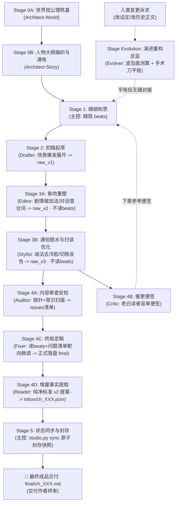

	# AGENTS.md — Novel Studio 核心宪法（Antigravity 通俗网文全题材通用版 · AI 向）

Novel Studio 是专为网络小说多智能体协同深度定制的创作流水线框架（全题材通用）。
架构哲学：**大模型全权掌控创意脑洞、生动情节与通俗叙事；确定性引擎负责事实底座与数据台账；原生 Subagents 实现高效工序接力与闭环归档。**

> 🏆 **【最高网文语感规范】**：
> **绝不追求虚浮晦涩的所谓“纯文学质感”！读者是来爽读网文的，不是来啃生涩教材的！**
> 全流程核心准则：**通俗直白大白话、极度易读、极好扫读、无认知门槛、一口气读完停不下来！**

> ⚖️ **【事实与创作分离规范】**：
> 创作可以脑补，事实必须对账——事实唯一源头 = `final` 定稿正文；
> 状态唯一真值 = `state/` 十一表（含不可逆事实表与认知差表）；
> 一致性由引擎机械闸门与 Auditor 和 Fixer 兜底。

> 🧰 **【开工前置：运行环境】**：引擎依赖 5 个第三方库，缺失时 `studio.py` 会在启动瞬间
> 打印缺失模块与安装命令并以退出码 `3` 退出（不是业务问题，不要去改书）。
> ```bash
> python -m pip install -r requirements.txt   # pydantic / jieba / networkx / rich / rapidfuzz
> python studio.py --version                   # 自检：应打印 novel-studio 3.x
> ```
> 用虚拟环境时务必用该环境的 python 跑（`.venv/bin/python studio.py …`），
> 否则会拿系统解释器去找依赖。退出码契约：`0` 正常 / `1` 业务阻断 / `2` 用法错 / `3` 环境缺依赖。

---

## 一、 技术底座速览（黑盒边界）

以下能力全部封装在确定性引擎（`engine/`，黑盒）内，各角色只经 CLI 消费、禁知实现源码：

- **强类型状态机**：
1、Pydantic V2 十一表真值（current / persons / items / factions / places / lines / timeline / ledger / synopsis / locked / cognition）；
2、提案（proposal）为**章节事实增量**的唯一写入口，过 schema 校验、引文柔性接地、幂等登记、复式记账重算四道闸（设定层例外：Stage 0 建书播种与跨卷改版由 architect/evolver 直接写 `state/*.json`；
3、每次 sync 会对十一表盖章 SHA-256，绕过提案的离线手改由 `check` 的 `state_offline_edit` 档指名报出）；

- **命令面（31 个命令名 / 30 个处理函数）**：
`python studio.py help --json` 是命令目录、阶段配方与退出码契约的唯一自查入口（31 项命令与各角色矩阵映射图谱详见 [`docs/COMMAND_MATRIX.md`](file:///c:/Users/cg110902/Desktop/NOVEL/docs/COMMAND_MATRIX.md)）——含 lore 底层词典与实体知识库速查对账、cockpit 态势驾驶舱、check 事实体检、audit 确定性机械探针、recall 残酷四问自证、simulate 剧情推演沙盒、milestone 主线里程碑管理、sync 状态封存、ledger recompute 账本修复、snapshot 回滚、state at/diff/blame 时点切面与字段级溯源、
state rollup 卷末态势摘要（pack 前情注入源）、reconcile 卷末对账大修（机械复扫+投影 diff 工作单）、
check --trend 分数曲线 / --bisect 快照二分等；

- **读者记忆轴（advisory）**：
以正文落笔史推导读者印象——线温分层（hot/warm/cold，阈值按 weight 缩放）、
零落笔线（line_never_surfaced）、冷线计划回收提醒（line_recall_cold，pack/beats 侧另有「先锚定再兑现」操作提示）、
关键事实久未重现（locked/已揭示 knowledge）、对白声纹漂移（voiceprint_drift：句长/语气词/口头禅，
只测「怎么说话」不测人设）；全部不阻断，阈值走 `project.json` 的 `reader_memory` / `voiceprint` 键
（PARAM_SPEC 单一真源）；

- **规模经济**：
changelog 事件溯源（state at 重放任意章切面 / blame 字段级溯源 / external_edit 自愈补录）、
卷级 rollup（前情态势 ≤1000 token 注入 pack，装配成本 O(当前卷)）、卷末 reconcile 对账大修（投影误差的周期性维护）；

- **装配预算契约**：
`pack` 预算 token 总量上限放宽至 **30,000 Token**；
  超预算时按压缩阶梯适度裁剪冷索引，**beats 全文 / current / 硬提醒 / 不可逆事实 / 钉住的世界锚点永不自动裁**；
  
- **装配包面（Drafter 的全部输入）**：
P0＝`current` 块（含 loadout 中文名）＋卷段里程碑＋`world_anchors`＋
  **beats 逐字全文**＋`prev_tail`＋`hard_reminders`＋`aftershock`（上章 `locked` 代价回灌）；
  P1＝`entities`（脊柱＋`trace` 近 3 章）＋`indirect`（图 2-hop）＋`spine`（脊柱尾 3 条）；P2＝`old_chapter_pointers`＋`file_index`；
  
- **强援库**：jieba（专名与词频）、networkx（实体拓扑寻路）、rapidfuzz（引文模糊接地）、rich（终端渲染）、sqlite3（FTS5 检索加速）。

---

## 二、 角色矩阵与权限协同体系

所有 Subagents 独立读取自身 `.agents/skills/<角色>/SKILL.md` 开展作业，主控仅负责下发与验收。除主控与架构师使用顶级模型（`inherit`）外，其余执行工序显式锁定 `Model: "flash"`。

| 角色 | 形式 | 负责阶段 | 核心职责与严格边界 |
|---|---|---|---|
| **主控 (Director)** | 宿主主代理 | 全局统筹 / Stage 1 / Stage 5 | **总制片人、首席主笔与全局统筹**：全书叙事弧线与节奏把控；前瞻研判与动态大纲管理（向作者确认后调优）；细纲反套路构思；驱动极速流水线与状态原子封存。 |
| **架构师 (Architect)** | 原生子代理 | Stage 0A / 0B（仅开新书触发） | **开局世界观与宏观大纲架构师**：Greenfield 宏观造物主，完成世界公理、人物卡、大纲与十一表通电。 |
| **起草员 (Drafter)** | 原生子代理 | Stage 2 | **剧情爆发起草先锋**：放飞算力与想象力，以通俗大白话展开核心场景，将戏剧目标转化为初稿毛坯 `raw/ch_XXX_v1.md`（字数 2000~3000+）。100% 依靠 pack 展开，恪守准读清单，落盘即交卷。 |
| **精修师 (Editor)** | 原生子代理 | Stage 3A | **纯粹骨肉做加法（不读 beats、不跑命令）**：以充实剧情血肉为导向，展开场景博弈交锋、丰富人物互动温度与对话潜台词、缝合转折气口；产出初修骨肉稿 `raw/ch_XXX_v2.md`。 |
| **脱水师 (Stylist)** | 原生子代理 | Stage 3B | **通俗脱水与扫读优化（不读 beats、不跑命令）**：以极度易读、方便扫读为导向，做足减法与表情动作去僵化（切除反刍总结、消除冷脸套路、比喻克制白描化），产出脱水预定稿 `raw/ch_XXX_v3.md`。 |
| **审查员 (Auditor)** | 原生子代理 | Stage 4A (并发安检) | **客观内容审查安检机（不读 beats）**：运行底层 8 大机械探针，配合 LLM 语义常识与 ask 问书求据（遇疑必 ask 调阅角色卡逆鳞/设定，拒绝主观臆断），输出极简问题清单 `log/audit/issues_ch_XXX.md`（无问题写“无”）。 |
| **催更员 (Critic)** | 原生子代理 | Stage 4B (并发便签) | **追更老白催更便签（专供下章参考）**：扮演十年老白盲审 `raw_v3` 稿件，纯读者体验不跑命令，评估疲劳度与活人感，输出 300~600 字催更便签 `log/critic/ch_XXX.md`，直供下章细纲构思。落盘即交卷。 |
| **定稿师 (Fixer)** | 原生子代理 | Stage 4C | **终局把关与法定定稿**：读 beats、`raw_v3` 与问题清单，遇争议定向 ask 调阅法定称谓与微动作，靶向微调正文硬矛盾；**正式落盘全书唯一法定定稿 `final/ch_XXX.md`**，并生成 Stage 5 放行凭证。 |
| **审计员 (Reader)** | 原生子代理 | Stage 4D | **增量事实提取（v2 提案）**：以 final 为唯一法定事实源，利用 ask 查重已有实体 ID，客观提取核心事实（现场即时态、主角随身资产与家底快照、新实体、暗线、不可逆事实），装配标准 v2 JSON 提案 `state/inbox/ch_XXX.json`。 |
| **图书管理员 (Librarian)** | 原生子代理 | 每10章低频巡查 | **十年长程事实巡检与账目平账**：每 10 章深度巡检，卷末对账大修，补齐次要实体与充能差账。 |
| **重构师 (Evolver)** | 原生子代理 | Stage Evolution (中途随时触发) | **剧情外科主任与演进重构总监**：专职承接人类作者全生命周期中途提出的任何变更诉求（改设定、改历史正文、改人设）。 |

---

## 三、 创作工序流水线（全新 7 步极速闭环）




---

## 四、 双向极简工序协议（跨角色 · Canonical）

> 💡 **双向极简规范**：主控下发 4 行派发令（严禁拷贝细纲全文或重复背诵工艺规则）；子代理上报 3 行回执单（严禁长篇汇报闲聊，杜绝主控上下文膨胀）。子代理技能卡内的回执细则以本协议为总纲。
>
> ⚡ **【派发算力契约（双核驱动版）】**：主控调用 `invoke_subagent` 时，除了 `director`（主控自己）与`architect`（架构师）使用顶级算力（`Model: "inherit"`）外，其余所有执行工序（子代理）必须显式传入参数 `Model: "flash"`，杜绝默认继承导致 Token 预算浪费。

- **下达 · 4 行标准工序派发令**（主控发给 Subagent）：
  ```text
  【章节工序派发令】
  - 书籍工作区：workspace/<书名>
  - 分卷与章节：vol_XX / ch_XXX
  - 执行阶段：Stage X (<角色名>: <阶段职责>)
  - 执行纪律：严格按你的 SKILL.md 执行。恪守准读清单与准写路径，落盘即止，严禁自查与编写脚本。
  ```
- **上报 · 3 行标准完工回执单**（Subagent 交卷给主控）：
  ```text
  【章节工序完工回执】
  - 完工阶段：Stage X (<角色名>)
  - 产出路径：[目标文件相对路径]
  - 核心指标：[字数/核心指标/状态] ｜ 零脚本直接落盘 ｜ 验收达标无滞留
  ```

---

## 五、 创作生命周期与主控统筹枢纽 (Lifecycle & Orchestration Hub)

整个创作生命周期由宿主主控（Director）作为总指挥统一承接与运转：
1. **单一入口承接**：人类作者提出的一切创作意图（开新书、章节续写、演进重构或自然语言问诊），统一在前台由 Director 接入；
2. **总指挥自主调度**：Director 结合态势驾驶舱（`cockpit`）自主评估并调度相应工序，各子代理（Subagents）在收到标准派发令后独立作业，严禁彼此跨工序越权；
3. **闭环交付与终审**：每一工序单向流转至 Stage 5 状态原子封存后，由 Director 呈交作者终审。
*(主控的具体前瞻研判、动态调纲机制、情境化工具兵法与执行细节，详见 `.agents/skills/director/SKILL.md`，宪法不作冗余展开)*

---

## 六、 workspace 文件地图（`<repo>/workspace/<书名>/`）

```text
workspace/<书名>/
├── project.json              # 书配置：标题/题材/主角/字数带/敏感词与启发词/线索配额
├── bible/                    # 设定真理圣经（模块化物理底座，支持 SHA-256 漂移自检）
│   ├── 01_world_axioms.md    # 世界运转公理与空间/金手指法则
│   ├── 02_power_system.md    # 实力/位阶层级与物理破坏力标尺
│   ├── 03_factions_geography.md # 地缘政治分布与核心势力拓扑
│   ├── 04_economy_items.md   # 货币购买力锚点与消耗品分级法则
│   ├── 05_special_mechanics.md  # 题材专属机制/体质/血脉/阵营相克
│   ├── 06_style_guidelines.md   # 通俗大白话语感、微动作去冷脸词库
│   └── 07_deviations.md      # 本书绝对偏离清单（严禁触碰的套路红线）
├── characters/               # 核心人物档案（闭环称谓对校矩阵、微动作、Want/Fear）
│   ├── protagonist.md        # 主角终极档案
│   └── <角色名>.md           # 重要配角/女主/男配/反派标准卡
├── entities/                 # 核心三态实体账册（支持 CLI 穿透寻路与对账）
│   ├── items/                # 法宝/装备/重器卡（损耗/充能/权属生命周期）
│   ├── factions/             # 宗门/组织/集团卡（核心资产/外交敌友态势）
│   └── locations/            # 关节点/据点/场景卡（感官锚点/运转律则/足迹）
├── outlines/
│   ├── main_plot.md          # 全书脊柱（故事引擎与宏观里程碑）
│   └── vol_XX/
│       ├── outline.md        # 分卷大纲（四分位阶段航标；主控可动态修纲）
│       └── beats/ch_XXX.md   # 当章细纲任务书（含法定事实与称谓对校清单）
├── manuscript/vol_XX/
│   ├── raw/
│   │   ├── ch_XXX_v1.md      # 初稿毛坯（Stage 2 Drafter 产出）
│   │   ├── ch_XXX_v2.md      # 初修骨肉稿（Stage 3A Editor 产出）
│   │   └── ch_XXX_v3.md      # 脱水预定稿（Stage 3B Stylist 产出）
│   └── final/ch_XXX.md        # 终局法定定稿（Stage 4C Fixer 产出，全书事实唯一源头）
├── state/                    # 十一表真值（含 locked/cognition） + inbox/ 提案收件箱 + snapshots/ 快照
├── log/audit/issues_ch_XXX.md # 质检问题清单（Stage 4A Auditor 产出，供 4C 定稿参考）
├── log/critic/ch_XXX.md      # 老白催更便签（Stage 4B Critic 产出，供下章细纲参考）
├── log/branches/ch_XXX.md    # 分支参谋单（可选）
├── log/review/               # 校对注记 + Librarian 长程巡检报告 sweep_ch_XXX.md
└── export/                   # 全书编译产物（--txt / --views 状态视图）
```

---

## 七、 跨角色核心红线（任何 Stage 不可逾越）

1. **引擎黑盒规范**：严禁任何角色（agent）读取或修改 `engine/*.py` 源码，也不必读 `engine/schemas/*.json`
   （给引擎读的构建产物；人读等价信息在 `templates/README.md` 第四节，写错字段时 `check`/`sync` 报错会点名）；
   命令用法以 `python studio.py help --json` 为唯一自查入口；
   
2. **防污染原则**：稿件严禁工程痕迹（未填槽位 `{{slot:...}}`、候选字段 `candidate_*`）；

3. **人类终审规范**：全程跑通后，主控向人类作者交付定稿成品与核心看点，最终裁决权 100% 归人类作者；

4. **全周期变更归 Evolver 规范**：长篇中途任何修改诉求一律由主控派发给专职的 `Evolver`（演进重构师）执行快照先行、波及面测算、跨层手术刀落地与状态对齐（确保 `check` 0 报错）；严禁单章工匠私改设定与历史正文；

5. **双核体检与主控大脑绝缘规范**：健康体检分为系统工程运行时健康与商业小说叙事健康。人类提出的任何查账问诊意图，轻量级事实直接调取零 Token 本地 CLI 工具，跨章重型研判派发给临时隔离沙盒，**坚决严禁主控在自身主上下文通读多章历史正文**，死守大脑纯净度与构思算力；


---

## 八、 架构分工与协议导航（单 SKILL 强内聚）

所有业务心法、工艺规范与权限清单已 100% 熔炼进各角色的自完备技能卡：
- 引擎命令图谱：[`docs/COMMAND_MATRIX.md`](file:///c:/Users/cg110902/Desktop/NOVEL/docs/COMMAND_MATRIX.md)（Engine 31 核心命令与多智能体矩阵映射全景图）
- 主控调度技能：`.agents/skills/director/SKILL.md`（总制片人与首席主笔、前瞻研判、动态大纲管理、反套路构思、四大实战武器库、流水线统筹与状态封存）
- 架构筑基技能：`.agents/skills/architect/SKILL.md`（Stage 0A 世界公理筑基、Stage 0B 人物大纲编织与状态通电）
- 演进重构技能：`.agents/skills/evolution/SKILL.md`（Stage Evolution 剧情外科手术、历史正文 Retcon、设定演进与十一表平账；技能目录名为 `evolution`，角色称谓统一为【演进重构师 / Evolver】——按目录取技能、按称谓派单）
- 起草先锋技能：`.agents/skills/drafter/SKILL.md`（场景推进、严格继承细纲事实，产出 `raw_v1`）
- 骨肉重塑技能：`.agents/skills/editor/SKILL.md`（剧情做加法、人物交互、气口缝合、事实对账，产出 `raw_v2`）
- 风格雕琢技能：`.agents/skills/stylist/SKILL.md`（通俗脱水、去冷脸活力注入、去反刍说教、比喻脱水、遣词准确、扫读优化，产出 `raw_v3`）
- 审查安检技能：`.agents/skills/auditor/SKILL.md`（三轨核验：8大机械探针 + 常识出戏审查 + 遇疑 ask 求据，产出 `issues` 清单）
- 读者催更技能：`.agents/skills/critic/SKILL.md`（十年老白纯盲审催更便签，直供下章细纲参考）
- 终审定稿技能：`.agents/skills/fixer/SKILL.md`（读 beats、raw_v3 与问题清单靶向微调，正式落盘全书唯一法定定稿 `final`）
- 事实审计技能：`.agents/skills/reader/SKILL.md`（核心事实抓取、动态演变提炼、JSON Schema 提案入箱）
- 长程巡检技能：`.agents/skills/librarian/SKILL.md`（十年长程事实巡检、词频与实体平账）
