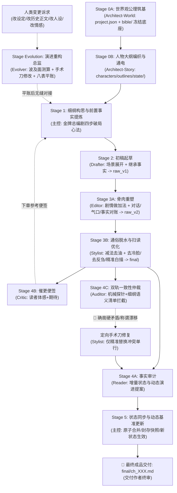

# AGENTS.md — Novel Studio 核心宪法（Antigravity 通俗网文全题材通用版 · AI 向）

Novel Studio 是专为网络小说多智能体协同深度定制的创作流水线框架（全题材通用）。
架构哲学：**大模型全权掌控创意脑洞、生动情节与通俗叙事；确定性引擎负责事实底座与数据台账；原生 Subagents 实现高效工序接力与闭环归档。**

> 🏆 **【最高网文语感规范】**：
> **绝不追求虚浮晦涩的所谓“纯文学质感”！读者是来爽读网文的，不是来啃生涩教材的！**
> 全流程核心准则：**通俗直白大白话、极度易读、极好扫读、无认知门槛、一口气读完停不下来！**

> ⚖️ **【事实与创作分离规范】**：
> 创作可以脑补，事实必须对账——事实唯一源头 = `final` 定稿正文；
> 状态唯一真值 = `state/` 八表（含不可逆事实表与认知差表）；
> 一致性由引擎机械闸门与 Auditor 双轨核验兜底。

---

## 一、 技术底座速览（黑盒边界）

以下能力全部封装在确定性引擎（`engine/`，黑盒）内，各角色只经 CLI 消费、禁知实现源码：

- **强类型状态机**：Pydantic V2 八表真值（current / entities / lines / timeline / ledger / synopsis / locked / cognition）；提案（proposal）为唯一写入口，过 schema 校验、引文柔性接地、幂等登记、复式记账重算四道闸；
- **命令面（29 个生产指令）**：`python studio.py help --json` 是命令目录、阶段配方与退出码契约的唯一自查入口——含 lore 底层词典与实体知识库速查对账、cockpit 态势驾驶舱、check 事实体检、audit 确定性机械探针、recall 残酷四问自证、simulate 剧情推演沙盒、milestone 主线里程碑管理、sync 状态封存、ledger recompute 账本修复、snapshot 回滚等；
- **强援库**：jieba（专名与词频）、networkx（实体拓扑寻路）、rapidfuzz（引文模糊接地）、rich（终端渲染）、sqlite3（FTS5 检索加速）。

---

## 二、 角色矩阵与权限协同体系

所有 Subagents 独立读取自身 `.agents/skills/<角色>/SKILL.md` 开展作业，主控仅负责下发 4 行派发令并验收 3 行完工回执。

| 角色 | 形式 | 负责阶段 | 核心职责与严格边界 |
|---|---|---|---|
| **主控 (Director)** | 宿主主代理 | 全局统筹 / Stage 1 / Stage 5 | **全局统筹、意图分流、前置事实提炼、双核体检与状态封存**：识别用户意图（开新书派发 Architect 0A/0B，继续写驾驶舱秒接，改设定/改正文定向派发 Evolver，自然语言问诊查账零Token本地CLI秒回或临时沙盒轻重分流）；细纲构思（金牌总编剧四步破局心法）；轻量星形调度流水线；执行 `sync` 状态原子封存。 |
| **架构师 (Architect)** | 原生子代理 | Stage 0A / 0B（仅开新书触发） | **开局世界观与宏观大纲架构师**：纯粹 Greenfield 宏观造物主，开新书时执行双子星阶梯接力（0A 筑基世界公理 `bible/01~07` ➔ 0B 编织人物大纲并完成八表通电）。独立沙盒运行，落盘即交卷，为主控保持 100% 纯净算力。 |
| **起草员 (Drafter)** | 原生子代理 | Stage 2 | **剧情爆发起草先锋**：放飞算力与想象力；**严格继承细纲预提炼的称谓、前情事实与知情差**，以通俗大白话展开核心场景，将戏剧目标转化为初稿毛坯 `raw/ch_XXX_v1.md`（字数 2000~3000+）。恪守准读清单，落盘即交卷。 |
| **精修师 (Editor)** | 原生子代理 | Stage 3A | **骨肉重塑与事实对账**：以充实剧情血肉为导向；**负责做足剧情加法**（展开场景交锋、丰富人物互动温度、重塑对话潜台词、缝合转折气口；准读在场核心角色卡与 `06_style_guidelines.md`）；产出通俗大白话初修骨肉稿 `raw/ch_XXX_v2.md`。 |
| **脱水师 (Stylist)** | 原生子代理 | Stage 3B | **通俗脱水、去冷脸与扫读优化**：以极度易读、方便扫读、通俗直白为导向；首行规范输出章题；以 `06_style_guidelines.md` 为基线，**负责做足减法与表情动作去僵化**（切除动作后反刍总结、消除主角冷脸与神色淡然套路、比喻脱水白描化、确保遣词造句自然准确），直接落盘全书法定定稿 `final/ch_XXX.md`。 |
| **审计员 (Reader)** | 原生子代理 | Stage 4 (并行轨 A) | **精益事实审计与动态演进提取**：以 final 为唯一事实源，客观提取核心事实（现场在场、动态关系与称谓演进、关键新实体、线索动作、大额收支、不可逆事实），装配严格符合 Pydantic V2 Schema 的标准增量提案 JSON (`state/inbox/ch_XXX.json`)。 |
| **催更员 (Critic)** | 原生子代理 | Stage 4 (并行轨 B) | **追更老白催更便签（专供下章参考）**：扮演十年老白追更读者盲审 final 正文，评估疲劳度与活人感，输出 200~500 字催更便签 `log/critic/ch_XXX.md`，直供下章细纲构思。落盘即交卷。 |
| **仲裁员 (Auditor)** | 原生子代理 | Stage 4 (并行轨 C) | **双轨一致性仲裁（机械探针+细纲语义清单）**：基于引擎 `audit` 输出的 8 大确定性机械探针，结合细纲预提炼清单逐行对校称谓、修饰词漂移检查，输出仲裁报告 `log/audit/ch_XXX.md`。检出 🔴 确凿硬矛盾立即下达定向手术刀修复指令。 |
| **图书管理员 (Librarian)** | 原生子代理 | Stage 4D (每10章低频巡查) | **十年长程事实巡检与账目平账**：每 10 章执行一次深度巡检，通读近 10 章定稿，清查遗漏次要实体、法宝道具充能漏扣与生死状态，把修补直接并入当章在途提案 `state/inbox/ch_XXX.json`。 |
| **重构师 (Evolver)** | 原生子代理 | Stage Evolution (中途随时触发) | **剧情外科主任与演进重构总监**：专职承接人类作者全生命周期中途提出的**任何变更诉求**（改设定、改历史正文段落、改人物设定、改事件因果、开辟新卷地图等）。负责波及面测算、快照先行、跨层手术刀修改与八表平账（`ledger recompute`, `check`）。独立沙盒运行，落盘即交卷。 |

---

## 三、 创作工序流水线



---

## 四、 双向极简工序协议（跨角色 · Canonical）

> 💡 **双向极简规范**：主控下发 4 行派发令（严禁拷贝细纲全文或重复背诵工艺规则）；子代理上报 3 行回执单（严禁长篇汇报闲聊，杜绝主控上下文膨胀）。子代理技能卡内的回执细则以本协议为总纲。

- **下达 · 4 行标准工序派发令**（主控发给 Subagent）：
  ```text
  【章节工序派发令】
  - 书籍工作区：workspace/<书名>
  - 分卷与章节：vol_XX / ch_XXX
  - 执行阶段：Stage X (<角色名>: <阶段职责>)
  - 执行纪律：严格按你的 SKILL.md 执行。恪守准读清单与准写路径，落盘即止，严禁自查与编写脚本。
  ```
- **上报 · 3 行标准完工回执单**（Subagent 交卷给主控）：
  ```text
  【章节工序完工回执】
  - 完工阶段：Stage X (<角色名>)
  - 产出路径：[目标文件相对路径]
  - 核心指标：[字数/核心指标/状态] ｜ 零脚本直接落盘 ｜ 验收达标无滞留
  ```

---

## 五、 开工认知与意图分流协议

主控在收到人类作者指令时，按以下认知与意图网关执行分流：

### 1. 🌟 意图 A：【开新书 / 新建项目 / 构思新设定】
- 接收核心脑洞（书名、题材、主角金手指、核心爽点）；
- **启动 Stage 0 双子星阶梯接力**：
  1. 主控下发 **Stage 0A 派发令给 `Architect`**（世界观公理筑基：生成 `project.json` 与 `bible/01~07`，落盘即冻结物理底座）；
  2. Stage 0A 完工唤醒后，主控下发 **Stage 0B 派发令给 `Architect`**（以冻结 bible 为硬基准，生成 `characters/`、`entities/` 与 `outlines/`，并完成状态八表通电）；
- `Architect` 0B 交卷后，主控运行 `python studio.py check` 与 `cockpit --json` 接入新书驾驶舱，向人类呈现世界观纲要供终审确认。

### 2. 🚀 意图 B：【继续写 / 创作下一章 / 推进工程】
- **核验 `workspace/` 目录**：
  - 若 `workspace/` 为空 ➔ 提示当前尚无工程，引导发起“开新书”；
  - 若存在多部书籍 ➔ 列出所有书名，主动询问作者意向；
  - 若仅有单本书（或已指定） ➔ 运行 `python studio.py cockpit --json` 秒级接入驾驶舱，直通 Stage 1 细纲构思！

### 3. 🛠️ 意图 C：【中途变更与演进重构】
- **触发场景**：人类作者提出任何维度的修改需求（改设定、改历史正文、改人设称谓、改事件因果、开启新地图或引入新核心实体）；
- **派发机制**：主控下达 **Stage Evolution 派发令给 `Evolver`（演进重构师）**；
- **执行闭环**：`Evolver` 独立完成因果研判、防御快照、跨层手术刀修改与八表平账（`ledger recompute`, `check`）；
- 交卷后主控接入驾驶舱汇报平账明细，无缝推进后续创作。

### 4. 🩺 意图 D：【自然语言问诊、查账与深度研判】
- **零 Token 认知准则**：所有本地确定性命令（`check`, `doctor`, `lore`, `pov`, `calendar`, `cockpit` 等）由本地算法运算，**0 Token 消耗**；
- **分流机制（双层防御，主控大脑绝缘保护）**：
  - ⚡ **Tier 1：轻量即时查账与体检（本地 0-Token 工具秒回）**：主控直接调用本地命令（`check`, `lore`, `pov`, `calendar`），提炼事实后以通俗大白话向人类解答，主控上下文保持纯净；
  - 🔬 **Tier 2：跨章重型研判（临时沙盒物理隔离）**：涉及通读多章历史正文时，**主控严禁在自身上下文通读数万字历史正文**，现场派发临时调研子代理完成研读，交付 300~500 字诊断简报后即刻销毁。

---

## 六、 workspace 文件地图（`<repo>/workspace/<书名>/`）

```text
workspace/<书名>/
├── project.json              # 书配置：标题/题材/主角/字数带/敏感词与启发词/线索配额
├── bible/                    # 设定真理圣经（模块化物理底座，支持 SHA-256 漂移自检）
│   ├── 01_world_axioms.md    # 世界运转公理与空间/金手指法则
│   ├── 02_power_system.md    # 实力/位阶层级与物理破坏力标尺
│   ├── 03_factions_geography.md # 地缘政治分布与核心势力拓扑
│   ├── 04_economy_items.md   # 货币购买力锚点与消耗品分级法则
│   ├── 05_special_mechanics.md  # 题材专属机制/体质/血脉/阵营相克
│   ├── 06_style_guidelines.md   # 通俗大白话语感、微动作去冷脸词库
│   └── 07_deviations.md      # 本书绝对偏离清单（严禁触碰的套路红线）
├── characters/               # 核心人物档案（闭环称谓对校矩阵、微动作、Want/Fear）
│   ├── protagonist.md        # 主角终极档案
│   └── <角色名>.md           # 重要配角/女主/反派标准卡
├── entities/                 # 核心三态实体账册（支持 CLI 穿透寻路与对账）
│   ├── items/                # 法宝/装备/重器卡（损耗/充能/权属生命周期）
│   ├── factions/             # 宗门/组织/集团卡（核心资产/外交敌友态势）
│   └── locations/            # 关节点/据点/场景卡（感官锚点/运转律则/足迹）
├── outlines/
│   ├── main_plot.md          # 全书脊柱（故事引擎与宏观里程碑）
│   └── vol_XX/
│       ├── outline.md        # 分卷大纲（四分位阶段航标；主控可动态修纲）
│       └── beats/ch_XXX.md   # 当章细纲任务书（含法定事实与称谓对校清单）
├── manuscript/vol_XX/
│   ├── raw/
│   │   ├── ch_XXX_v1.md      # 初稿毛坯（Stage 2 Drafter 产出）
│   │   └── ch_XXX_v2.md      # 初修骨肉稿（Stage 3A Editor 产出）
│   └── final/ch_XXX.md       # 定稿（Stage 3B Stylist 产出，事实唯一源头）
├── state/                    # 八表真值（含 locked/cognition） + inbox/ 提案收件箱 + snapshots/ 快照
├── log/critic/ch_XXX.md      # 老白催更便签（Stage 4B 产出，供下章细纲参考）
├── log/audit/ch_XXX.md       # 一致性仲裁报告（Stage 4C 产出；双轨仲裁）
├── log/branches/ch_XXX.md    # 分支参谋单（可选）
├── log/review/               # 校对注记 + Librarian 长程巡检报告 sweep_ch_XXX.md
└── export/                   # 全书编译产物（--txt / --views 状态视图）
```

---

## 七、 跨角色核心红线（任何 Stage 不可逾越）

1. **引擎黑盒规范**：严禁任何角色读取或修改 `engine/*.py` 源码；命令用法以 `python studio.py help --json` 为唯一自查入口；
2. **零脚本规范**：子代理严禁编写/运行任何统计、验证或测试脚本；状态同步与体检全权归主控 Stage 5；
3. **防污染原则**：稿件严禁工程痕迹（未填槽位 `{{slot:...}}`、候选字段 `candidate_*`）；
4. **反套路与章型差异化规范**：主控 80% 算力锁定在 Stage 1 创意脑洞，执行《金牌总编剧四步破局心法》（扫雷排除平庸套路、三维反差推演、招牌记忆物象、人际情感微澜与互动潜台词），坚决打破流水线套路复读；
5. **Critic 直通规范**：催更便签仅供下章细纲参考（主控参考），当章流水线直通 Stage 5；
6. **动态演进与闭环规范**：正文发生的称谓与关系演变由 Reader 提炼并封存入账，入账后自动成为后续章节新基准，严禁无故随机漂移；
7. **人类终审规范**：全程跑通后，主控向人类作者交付定稿成品与核心看点，最终裁决权 100% 归人类作者；
8. **实体双键与二八分级规范**：全书实体统一采用 `p_XXX` / `it_XXX` / `fac_XXX` / `loc_XXX` 物理 ID 终身绑定，改名重铸不丢状态；核心主配角与关键重器建立 `.md` 全息卡，次要路人小角色仅在 `entities.json` 留痕入账（`card: ""`），严禁滥建 `.md` 碎片卡造成上下文与文件污染；
9. **全周期变更归 Evolver 规范**：长篇中途任何修改诉求一律由主控派发给专职的 `Evolver`（演进重构师）执行快照先行、波及面测算、跨层手术刀落地与八表平账（`ledger recompute`、`check`）；严禁单章工匠私改设定与历史正文；
10. **双核体检与主控大脑绝缘规范**：健康体检分为系统工程运行时健康与商业小说叙事健康。人类提出的任何查账问诊意图，轻量级事实直接调取零 Token 本地 CLI 工具，跨章重型研判派发给临时隔离沙盒，**坚决严禁主控在自身主上下文通读多章历史正文**，死守大脑纯净度与构思算力。

---

## 八、 架构分工与协议导航（单 SKILL 强内聚）

所有业务心法、工艺规范与权限清单已 100% 熔炼进各角色的自完备技能卡：
- 主控调度技能：`.agents/skills/director/SKILL.md`（全局统筹、Stage 0A/0B 调度、中途演进派发、细纲破局与状态同步）
- 架构筑基技能：`.agents/skills/architect/SKILL.md`（Stage 0A 世界公理筑基、Stage 0B 人物大纲编织与状态通电）
- 演进重构技能：`.agents/skills/evolution/SKILL.md`（Stage Evolution 剧情外科手术、历史正文Retcon、设定演进与八表平账）
- 起草先锋技能：`.agents/skills/drafter/SKILL.md`（场景推进、严格继承细纲事实，产出 `raw_v1`）
- 骨肉重塑技能：`.agents/skills/editor/SKILL.md`（剧情做加法、人物交互、气口缝合、事实对账，产出 `raw_v2`）
- 风格雕琢技能：`.agents/skills/stylist/SKILL.md`（通俗脱水、去冷脸活力注入、去反刍说教、比喻脱水、遣词准确、扫读优化，产出 `final`）
- 事实审计技能：`.agents/skills/reader/SKILL.md`（核心事实抓取、动态演变提炼、JSON Schema 提案）
- 读者催更技能：`.agents/skills/critic/SKILL.md`（十年老白纯盲审催更便签）
- 一致性仲裁技能：`.agents/skills/auditor/SKILL.md`（双轨核验、机械探针+语义对账、定向手术刀指令）
- 长程巡检技能：`.agents/skills/librarian/SKILL.md`（十年长程事实巡检、词频与实体平账）
