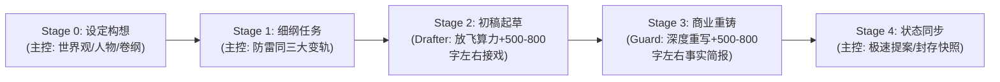

# AGENTS.md — Novel Studio 核心宪法（Antigravity 原生版）

欢迎使用 **Novel Studio**。本系统是专为 **Google Antigravity** 深度定制的高效、现代化网络小说创作智能体框架。
核心理念：**LLM 掌控无限创意与文学重铸，确定性引擎负责设定锚定与数据核算，原生 Subagents 实现多工序流水线作业**。

---

## 一、 角色分工与 Antigravity 协同体系

| 角色 | 形式 | 负责阶段 | 核心职责与工艺依据 |
|---|---|---|---|
| **主控 (Director)** | 宿主主代理 | Stage 0 / 1 / 4 | 全局导演：负责世界观大纲设定、防雷同单章细纲装配、调度子代理、依据 Guard 500~800 字左右简报极速状态同步与快照封存。 |
| **起草员 (Drafter)** | 原生子代理 (Subagent) | Stage 2 | 情节起草：彻底松绑放飞算力，吸纳上章 500~800 字左右完整尾声场面，全力将细纲转化为冲突饱满、人物生动的毛坯初稿 `raw/`。 |
| **精修师 (Guard)** | 原生子代理 (Subagent) | Stage 3 | 商业重铸：依据 `craft_guard.md` 担任金牌总编，深度重写填坑，产出丝滑定稿 `final/`，交付 500~800 字左右结构化事实简报。 |

> 💡 **Antigravity 调度规范**：
> 主控在 Stage 2 和 Stage 3 阶段，直接使用 Antigravity 原生工具 `invoke_subagent`（指定 `TypeName: "self"`，并配置对应 `Role: "Drafter"` / `Role: "Guard"` 与任务上下文 Prompt）派发独立子代理任务，实现上下文隔离与专业化生产。

---

## 二、 五阶段极简创作流水线 (Stage 0–4)

1. **Stage 0 设定构想（主控）**：确立题材、书名、核心设定（`bible/`）、人物卡（`characters/`）与主线大纲（`outlines/`）。
2. **Stage 1 细纲与任务书（主控）**：执行防雷同三大变轨，装配当章拍点与线动作（`outlines/vol_XX/beats/ch_XXX.md`）。
3. **Stage 2 初稿起草（Drafter）**：主控派发子代理（放飞算力，融合上章 500~800 字左右尾声接戏），完成初稿 `manuscript/vol_XX/raw/ch_XXX_v1.md`。
4. **Stage 3 商业重铸（Guard）**：主控派发子代理（遵循 `craft_guard.md` 深度重写），生成定稿 `manuscript/vol_XX/final/ch_XXX.md` 并提交 500~800 字左右结构化事实简报。
5. **Stage 4 极速同步与归档（主控）**：根据 Guard 简报一键更新状态机（`state/inbox/`）并同步封存（`python studio.py sync ch_XXX`）。

---

## 三、 三大创作不变量

1. **事实一致不吃书**：正文事实为源，`state/*.json` 为机器真值。
2. **伏笔暗线有台账**：重要伏笔（`GUN-*`）、秘密（`KNO-*`）、认知差/误会（`MIS-*`）登记入 `state/lines.json`。
3. **人物登场皆有据**：出场人物登记在 `state/entities.json`。

---

## 四、 省 Token 与防污染铁律

1. **引擎黑盒原则**：严禁主控或子代理读取 `engine/*.py` 源码！一律通过 `python studio.py <命令>` 交互。
2. **主控零盲读原则**：主控严禁在主会话中对 `raw/` 和 `final/` 执行全文 `view_file`，仅依据 Guard 的 500~800 字左右结构化事实简报进行状态同步。
3. **工作区精准投喂原则**：严禁全局盲读 `workspace/` 历史正文，历史连贯性由 `pack ch_XXX` 分层数据包（含上章 500~800 字左右尾声）供给。
4. **子代理沙箱隔离与定期轮转**：子代理在独立沙箱自闭环。

---

## 五、 文档与工具快速指引

- **工作流 SOP**：`.agents/rules/novel_workflow.md`
- **工艺总纲**：`.agents/rules/novel_craft.md`
- **精修总笔心法（Guard）**：`.agents/rules/craft_guard.md`
- **题材词库与风格参考**：`.agents/genre_guide.md`
