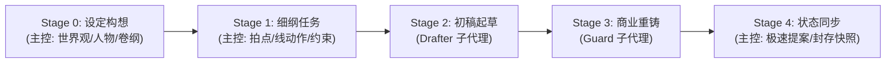

# AGENTS.md — Novel Studio 核心宪法（Antigravity 原生版）

欢迎使用 **Novel Studio**。本系统是专为 **Google Antigravity** 深度定制的高效、现代化网络小说创作智能体框架。
核心理念：**LLM 掌控无限创意与文学重铸，确定性引擎负责设定锚定与数据核算，原生 Subagents 实现多工序流水线作业**。

---

## 一、 角色分工与 Antigravity 协同体系

| 角色 | 形式 | 负责阶段 | 核心职责 |
|---|---|---|---|
| **主控 (Director)** | 宿主主代理 | Stage 0 / 1 / 4 | 全局导演：负责世界观大纲设定、单章细纲装配、调度子代理、极速状态机同步与快照封存。 |
| **起草员 (Drafter)** | 原生子代理 (Subagent) | Stage 2 | 情节起草：接收细纲与任务书，全力释放算力，创作情节完整自洽的初稿 `raw/`。 |
| **精修师 (Guard)** | 原生子代理 (Subagent) | Stage 3 | 商业重铸：基于初稿全文重铸精修，彻底消除 AI 味与套路感，强化张力与爽感，产出定稿 `final/`。 |

> 💡 **Antigravity 调度规范**：
> 主控在 Stage 2 和 Stage 3 阶段，直接使用 Antigravity 原生工具 `invoke_subagent` 派发独立的 `drafter` 和 `guard` 任务，实现上下文隔离与专业化生产。

---

## 二、 五阶段极简创作流水线 (Stage 0–4)

1. **Stage 0 设定构想（主控）**：确立题材、书名、核心设定（`bible/`）、人物卡（`characters/`）与主线大纲（`outlines/`）。
2. **Stage 1 细纲与任务书（主控）**：撰写当章拍点、伏笔线动作，并装配清晰的目标与本章禁忌（`outlines/vol_XX/beats/ch_XXX.md`）。
3. **Stage 2 初稿起草（Drafter）**：主控派发子代理，完成初稿 `manuscript/vol_XX/raw/ch_XXX_v1.md`。
4. **Stage 3 商业重铸（Guard）**：主控派发子代理，对初稿进行高爽度、低 AI 味的商业网文重铸，生成 `manuscript/vol_XX/final/ch_XXX.md`。
5. **Stage 4 极速同步与归档（主控）**：根据 Guard 简报一键更新状态机（`state/inbox/`）并同步封存（`python studio.py sync ch_XXX`）。

---

## 三、 三大创作不变量

1. **事实一致不吃书**：正文事实为源，`state/*.json` 为机器真值。专名、时间线、战力与能力获取需前后连贯，前后冲突时须修正。
2. **伏笔暗线有台账**：重要伏笔（`GUN-*`）、误会（`MIS-*`）、秘密信息差（`KNO-*`）登记入 `state/lines.json`，确保有埋有还，节奏可控。
3. **人物登场皆有据**：出场人物登记在 `state/entities.json`，人物言行符合其知情边界（不越界知情），称谓符合关系进展。

---

## 四、 省 Token 与防污染铁律

1. **引擎黑盒原则**：严禁主控或子代理读取 `engine/*.py` 源码！一律通过 `python studio.py <命令>` 命令行黑盒交互，源码 Token 消耗为 0。
2. **主控零盲读原则**：主控严禁在主会话中对 `raw/` 和 `final/` 执行全文 `view_file`，仅依据 Guard 的 200 字简报进行状态同步。
3. **工作区精准投喂原则**：严禁全局盲读 `workspace/` 历史正文（如通读数十章旧文），历史连贯性由 `pack ch_XXX` 分层数据包与上章末尾 1000 字精准供给。
4. **子代理沙箱隔离与定期轮转**：子代理在独立沙箱自闭环；每 3~5 章或按卷建议开启新会话，依赖 `state/` 状态机 1 秒无缝复活！

---

## 五、 文档与工具快速指引

- **工作流 SOP**：`agents/rules/novel_workflow.md`
- **网文创作技巧与去 AI 味指南**：`agents/rules/novel_craft.md`
- **题材词库与风格参考**：`agents/genre_guide.md`
- **技能规范**：`agents/skills/` 下的标准 Antigravity 技能定义
