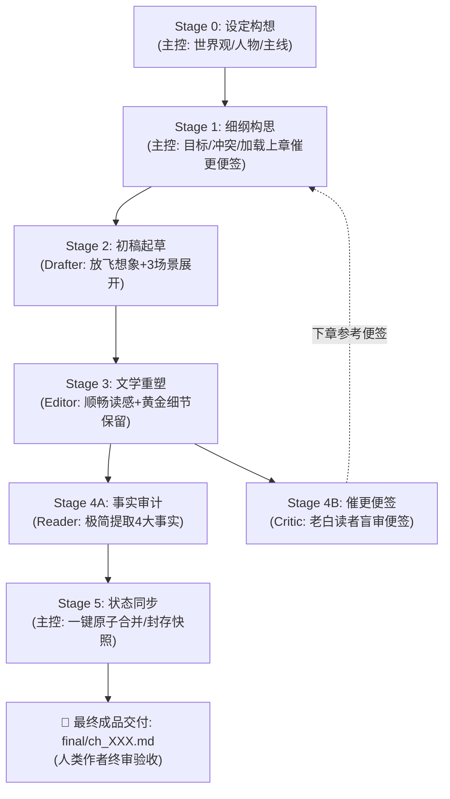

# AGENTS.md — Novel Studio 核心宪法（Antigravity 全题材通用版）

欢迎使用 **Novel Studio**。本系统是专为 **Google Antigravity** 深度定制的现代化长篇商业小说多智能体创作流水线框架。
核心理念：**大模型全权掌控创意脑洞、生动情节与文学重塑；确定性引擎负责事实底座与数据台账；原生 Subagents 实现高效工序接力与闭环归档**。
系统全面支持全题材创作。

---

## 一、 角色矩阵与权限协同体系

| 角色 | 形式 | 负责阶段 | 核心职责与严格边界 |
|---|---|---|---|
| **主控 (Director)** | 宿主主代理 | Stage 0 / 1 / 5 | **全局统筹、自主裁决与状态封存**：世界观与主线把控；细纲装配（**吸纳上章催更便签**）；使用**标准极简派发令**调度流水线（**严禁大段拷贝细纲与上章正文，给主控彻底减负**）；审定 Reader 提案并一键执行 `sync` 封存快照。人类作者免受中间过程打扰，负责最终成品验收。 |
| **起草员 (Drafter)** | 原生子代理 (`inherit`) | Stage 2 | **剧情爆发起草**：放飞算力与想象力；承接上章情境与细纲，展开 3 大场景，将戏剧目标转化为充满冲突、对白生动、动作见肉的初稿毛坯 `raw/ch_XXX_v1.md`（字数 2000~3000+）。恪守准读清单，落盘即交卷。 |
| **精修师 (Editor)** | 原生子代理 (`inherit`) | Stage 3 | **文学重塑与定稿**：以读感顺畅、节奏明快、欲罢不能为唯一导向；首行规范输出章题；全力保留黄金细节，彻底剔除 4 大解释性反刍与同质复读，一次精修成型直接落盘 `final/ch_XXX.md`。恪守准读清单，落盘即交卷。 |
| **审计员 (Reader)** | 原生子代理 (`inherit`) | Stage 4 (并行轨 A) | **精益事实审计与提案装配**：以 final 为唯一事实源，清晰提取 4 大核心事实（现场在场、关键新实体、主线伏笔、大额收支），装配标准增量提案 JSON (`state/inbox/ch_XXX.json`)。恪守准读清单，落盘即交卷。 |
| **催更员 (Critic)** | 原生子代理 (`inherit`) | Stage 4 (并行轨 B) | **老白催更便签（专供下章参考）**：扮演十年老白追更读者盲审 final 正文，输出 150~300 字便签 `log/critic/ch_XXX.md`（本章体感 + 下章读者最想看什么 / 最怕踩什么），**仅供下一章细纲构思参考，无一票否决权，当章流水线直通**。落盘即交卷。 |

### 💡 Antigravity 调度规范（极简派发 · 一步到位 · 绝不内耗）

0. **开工第一阶段：认知就绪与态势感知（冷启动校准 / 热启动直通）**：
   - ❄️ **新窗口冷启动（每个会话窗口首次开工 · 读且仅读 1 次）**：
     在当前会话窗口第一次收到人类指令时，**前 3 个 Tool Calls 必须先调用 `view_file` 依序通读三大核心底座文档**，彻底校准身份、纪律与架构认知：
     1. 📖 项目全貌与指令集：`README.md`
     2. ⚖️ 角色矩阵与铁血宪法：`AGENTS.md`
     3. 🎬 主控专属心法与协议：`.agents/skills/director/SKILL.md`
     完成三大底座校准后，第 4 个 Tool Call 执行 `python studio.py cockpit --json` 接入实时战况。
   - 🔥 **同会话热启动（连续写下一章 / 推进剧情）**：
     当前会话窗口此前已完成三大底座阅读并保有完整记忆，**严禁重复调用 `view_file` 冗余回读**；主控收到指令后直接执行第一反射动作：`run_command` 运行 `python studio.py cockpit --json` 秒级接入。
   - 驾驶舱在 0.1 秒内由确定性 Python 引擎聚合当前章节与活跃工序 Stage、下一步行动指令、开篇余震、现场信息差机锋、上一章读者催更雷达、**全书伏笔暗线分类雷达（即时短线/卷内中线/跨卷长线/沉寂预警）**与自愈处方；

1. **Stage 1 细纲就绪（创意最强大脑）**：主控作为全书创作总指挥与最强大脑，全权掌控反套路脑洞、悬念反转与惊喜看点。运行 `python studio.py beats new ch_XXX --write` 生成细纲脚手架后，主控吸纳 cockpit 中提取的上一章催更雷达/催更便签（读者最想看/最怕踩），将读者期待与自身的独家巧思、惊喜反差注入细纲，确认细纲落盘至 `outlines/vol_XX/beats/ch_XXX.md`。
2. **双向极简工序协议（下达派发令 + 上报回执单，主控防膨胀防内耗）**：
   - **下达 · 4 行标准工序派发令**（主控发给 Subagent，严禁拷贝细纲全文或重复背诵工艺规则）：
     ```text
     【章节工序派发令】
     - 书籍工作区：workspace/<书名>
     - 分卷与章节：vol_XX / ch_XXX
     - 执行阶段：Stage X (Drafter / Editor / Reader / Critic)
     - 执行纪律：严格按你的 SKILL.md 执行。恪守准读清单与准写路径，落盘即止，严禁自查与编写脚本。
     ```
   - **上报 · 3~4 行标准完工回执单**（Subagent 交卷给主控，严禁长篇抒情聊天，保持主控上下文绝对纯净）：
     ```text
     【章节工序完工回执】
     - 完工阶段：Stage X (Drafter / Editor / Reader / Critic)
     - 产出路径：[目标文件相对路径]
     - 核心指标：[字数/规范指标] ｜ 零脚本直接落盘 ｜ 验收达标无滞留
     ```
3. **Drafter 完稿唤醒**：Drafter 交付回执后主控被自动唤醒，立即向 Editor 下发 Stage 3 派发令；
4. **Editor 完稿唤醒**：Editor 交付回执后主控被自动唤醒，在**单次 `invoke_subagent` 调用中同时派发 Reader 与 Critic**，实现原生双轨并发质检与响应式唤醒（Zero Polling）；
5. **质检与状态同步（无阻塞直通）**：
   - **Critic 催更便签留存**：Critic 便签留作下章参考，**当章绝不打回**；
   - **主控一键秒级同步**：主控直接执行 Stage 5 状态同步（`python studio.py sync ch_XXX`），完成账目核验与快照封存；
6. **成品交付**：全程跑通后，主控向人类作者交付定稿作品与本章核心看点，最终裁决权 100% 归人类作者。

---

## 二、 创作工序流水线与铁血权限网关



### 🔒 铁血文件权限网关（准读清单 vs 禁读清单）

为杜绝“乱翻文件导致过度思考”与“漏看关键信息导致偷懒吃书”，所有 Agent 必须严格执行文件准读与禁读网关：

| 角色 | 负责工序 | 🟢 准读清单（Strict Whitelist · 必读且仅能读） | 🔴 禁读清单（Strict Blacklist · 绝对禁止读取） |
|---|---|---|---|
| **主控 Director** | Stage 0, 1, 5 | • `state/*`（当前状态与伏笔账本）<br/>• `outlines/`（大纲与细纲）<br/>• `log/critic/ch_{前一章}.md`（吸纳读者期待）<br/>• `templates/`（模板） | ❌ 严禁读取或修改 `engine/*.py` 源码（黑盒铁律） |
| **起草员 Drafter** | Stage 2 | 1. `outlines/vol_XX/beats/ch_XXX.md`（戏剧任务书）<br/>2. `manuscript/vol_XX/final/ch_{prev}.md`（上一章尾部 30-50 行，接戏动作；ch_001 跳过）<br/>*(或仅运行一次 `python studio.py pack ch_XXX` 替代上述两者)* | ❌ 严禁读取 `engine/*`<br/>❌ 严禁读取 `bible/*`、`characters/*`（细纲已提炼所需，防止信息过载）<br/>❌ 严禁读取 prev 之前的旧章正文<br/>❌ 严禁读取 `state/*` |
| **精修师 Editor** | Stage 3 | 1. `outlines/vol_XX/beats/ch_XXX.md`（核验戏剧目标与章末刀口）<br/>2. `manuscript/vol_XX/raw/ch_XXX_v1.md`（起草员初稿毛坯） | ❌ 严禁读取 `engine/*`<br/>❌ 严禁读取 `bible/*`、`characters/*`、`state/*`、`log/*`<br/>❌ 严禁读取其他章节正文 |
| **审计员 Reader** | Stage 4A | 1. `manuscript/vol_XX/final/ch_XXX.md`（当章定稿纯正文，事实唯一源头）<br/>2. `outlines/vol_XX/beats/ch_XXX.md`（核对伏笔与收支预期） | ❌ 严禁读取 `raw/*`（严禁以初稿为准！）<br/>❌ 严禁读取 `engine/*`<br/>❌ 严禁读取 `bible/*`、`characters/*`、旧章正文 |
| **催更员 Critic** | Stage 4B | 1. `manuscript/vol_XX/final/ch_XXX.md`（当章定稿纯正文） | ❌ 严禁读取 `beats/*`（读者严禁偷看作者大纲！）<br/>❌ 严禁读取 `raw/*`、`state/*`、`bible/*`、`characters/*`、`engine/*` |

---


## 三、 架构分工与协议导航

- **单 SKILL 强内聚架构（单一真理源）**：所有业务心法、工艺规范与权限清单已 100% 熔炼进各角色的自完备技能卡中。子代理启动即具备本岗位全部心法，无需在运行时读取任何外部规则文档：
  - 主控调度技能：`.agents/skills/director/SKILL.md`（全局统筹、极简派发与状态同步）
  - 起草先锋技能：`.agents/skills/drafter/SKILL.md`（3场景推进、微波澜拉扯、情绪流体力学）
  - 重铸定稿技能：`.agents/skills/editor/SKILL.md`（首行章题、4大反刍切除、同质去重、黄金细节）
  - 事实审计技能：`.agents/skills/reader/SKILL.md`（4大核心事实抓取、JSON Schema 标准提案）
  - 读者催更技能：`.agents/skills/critic/SKILL.md`（十年老白纯盲审催更便签）
