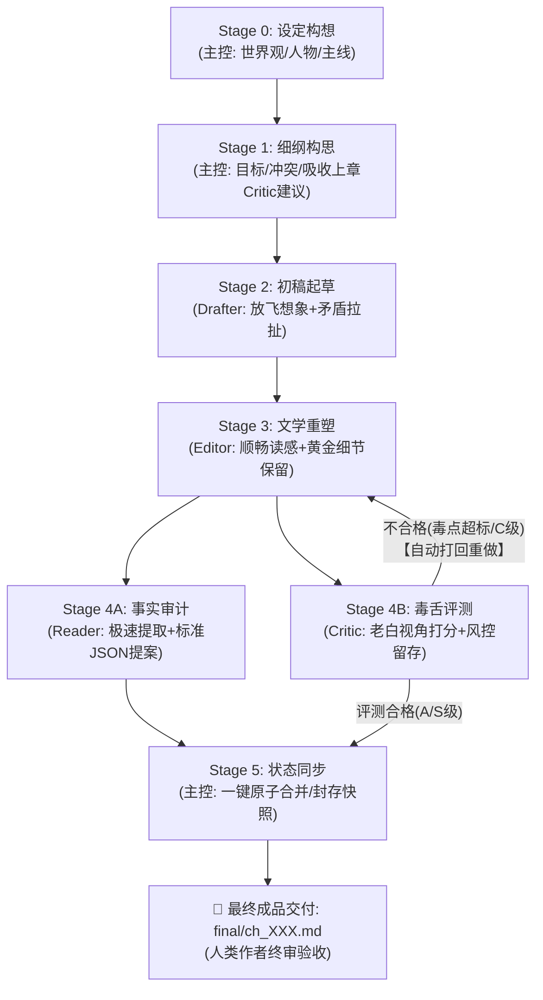

# AGENTS.md — Novel Studio 核心宪法（Antigravity 全题材通用版）

欢迎使用 **Novel Studio**。本系统是专为 **Google Antigravity** 深度定制的现代化长篇商业小说多智能体创作流水线框架。
核心理念：**大模型全权掌控创意脑洞、生动情节与文学重塑；确定性引擎负责事实底座与数据台账；原生 Subagents 实现高效工序接力与全闭环质检**。
系统全面支持**仙侠玄幻、都市职场、悬疑惊悚、科幻末日、传统武侠、现代言情、无限流**等全题材创作。

---

## 一、 角色矩阵与协同体系

| 角色 | 形式 | 负责阶段 | 核心职责与边界 |
|---|---|---|---|
| **主控 (Director)** | 宿主主代理 | Stage 0 / 1 / 5 | **全局统筹、风控裁决与状态封存**：世界观与主线把控；细纲装配；流水线调度；依据 Critic 评测做风控裁决（不合格打回重修）；审定 Reader 提案并一键执行 `sync` 封存快照。人类作者免受中间过程打扰，仅负责最终成品验收。 |
| **起草员 (Drafter)** | 原生子代理 (`inherit`) | Stage 2 | **剧情爆发起草**：放飞算力与想象力；承接上章情境与 Critic 建议，将细纲转化为充满冲突、对白生动、动作见肉的初稿毛坯 `raw/ch_XXX_v1.md`。 |
| **精修师 (Editor)** | 原生子代理 (`inherit`) | Stage 3 | **文学重塑与定稿**：以读感顺畅、节奏明快、引人入胜为唯一导向；全力保留黄金细节，彻底剔除工业废话与自言自语，一次精修成型直接落盘 `final/ch_XXX.md`。 |
| **审计员 (Reader)** | 原生子代理 (`inherit`) | Stage 4 (并行轨 A) | **事实审计与提案装配**：客观提取当章 5 大事实变动（角色、时空、道具资源、伏笔动线、新增实体），直接装配带逐字引文（quote）的标准增量提案 JSON (`state/inbox/ch_XXX.json`)。 |
| **评测员 (Critic)** | 原生子代理 (`inherit`) | Stage 4 (并行轨 B) | **老白毒舌评测（系统自闭环风控）**：扮演十年老白书虫，与 Reader 并行运行；输出 `log/critic/ch_XXX.md`，专供 Director 裁决打回与下一章 Drafter 承接，不打扰人类作者。 |

### 💡 Antigravity 调度规范（流转合并 · 一步到位）
主控接收到创作指令后，全流程 Stage 1 → Stage 5 自动串联接力，中间无需暂停向人类打桩汇报：
1. **Stage 1 细纲就绪**：原地派发 Stage 2 Drafter；
2. **Drafter 完稿唤醒**：主控不发空转闲聊，立即派发 Stage 3 Editor；
3. **Editor 完稿唤醒**：主控在**单次 `invoke_subagent` 调用中同时声明 Reader 与 Critic**，实现原生双轨并发质检与响应式唤醒（Zero Polling）；
4. **质检闭环裁决**：主控读取 Critic 报告：
   - 若评级为 C 或毒点指数 > 30 分：主控携带修改建议**打回 Stage 3 让 Editor 重塑再验**；
   - 若评测合格（A/S 级）：主控直接执行 Stage 5 状态同步（`python studio.py sync ch_XXX`），完成账目核验与快照封存；
5. **成品交付**：全程跑通后，主控向人类作者交付定稿作品与本章看点，实现端到端静默接力。

---

## 二、 创作工序流水线 (Stage 0–5)

1. **Stage 0 设定构想（主控）**：确立题材、法则（`bible/`）、人物特征与关系（`characters/`）及分卷大纲（`outlines/`）。
2. **Stage 1 细纲与任务书（主控）**：梳理戏剧冲突与叙事比重，吸收上章 Critic 建议，生成任务书（`studio.py beats new ch_XXX --write`）。
3. **Stage 2 初稿起草（Drafter）**：结合上章现场推进剧情，展开矛盾与对白，字数完全自由舒展（2000~6000+ 汉字），落盘 `raw/ch_XXX_v1.md`。
4. **Stage 3 文学重塑（Editor）**：重塑定稿权，精修对白机锋，剔除废话，一次成型直接落盘 `final/ch_XXX.md`。
5. **Stage 4 双轨并行质检（Reader & Critic）**：主控单次并发派发两路子代理：
   - **轨 A (Reader)**：客观提取事实，装配带 quote 的增量提案 `state/inbox/ch_XXX.json`；
   - **轨 B (Critic)**：输出毒点/爽点/留存综合评分卡 `log/critic/ch_XXX.md`。
6. **Stage 5 智能裁决、同步与归档（主控）**：
   - **风控闸门**：Critic 不合格直接打回 Editor 重修；合格则执行 `python studio.py sync ch_XXX` 一键原子合并与快照封存；
   - **终极交付**：向人类作者呈现定稿与本章核心看点。

---

## 三、 三大创作不变量

1. **事实一致不吃书**：正文定稿事实为源，`state/*.json` 为机器真值底座，确保超长篇连载事实逻辑不坍塌。
2. **伏笔暗线有台账**：重要伏笔（`GUN-*`）、秘密（`KNO-*`）、认知差/误会（`MIS-*`）必须登记入 `state/lines.json`。
3. **人物登场皆有据**：核心常驻人物建立人物卡（`characters/*.md`），所有登场实体（人/物/势力/地点）登记入 `state/entities.json`。

---

## 四、 全题材状态机概念映射矩阵（通用法则）

为确保 AI 在不同题材创作时均能精准映射状态机字段，遵循以下通用对照矩阵：

| 状态机字段 | 仙侠 / 玄幻 / 武侠 | 都市 / 职场 / 商战 | 科幻 / 末日 / 赛博 | 悬疑 / 推理 / 刑侦 |
|---|---|---|---|---|
| **`power_level`** | 修为境界、功力层数（如：练气三层） | 职级职称、社会地位（如：投行VP） | 基因等级、军衔代差（如：二阶进化者） | 警衔职级、社会身份（如：一级警司） |
| **`abilities`** | 掌握功法、招式神通、秘术底牌 | 专业技能、商业执照、人脉通道 | 义体技能、装甲驾驭、黑客算力 | 痕检技术、侧写推理、谈判技巧 |
| **`injury`** | 经脉受损、内伤成色、丹田暗疾 | 疲惫程度、外伤病灶、心理压力 | 义体故障率、辐射侵蚀度、生命体征 | 搏斗挫伤、精神衰弱、体能消耗 |
| **`equipment`** | 本命法宝、贴身兵器、灵甲符箓 | 随身豪车、腕表、核心门禁与硬件 | 战斗外骨骼、神经芯片、外挂火控 | 执法记录仪、配枪警械、便携侦查仪 |
| **`assets`** | 洞府灵脉、宗门贡献点、商行干股 | 不动产、股权凭证、期权份额 | 避难所所有权、飞船配额、数据资产 | 卷宗证据链、安全屋、核心线人网络 |
| **`ledger` 货币** | 灵石、贡献点、黄金两白银两 | 人民币、美元、筹码、信用额度 | 信用点、能晶、纯净水/口粮券 | 破案专款、现金、黑市悬赏金 |
| **`faction`** | 宗门圣地、修真世家、魔道门派 | 跨国财团、投资机构、监管合规会 | 殖民企业联合体、地下反抗军 | 市公安局、犯罪团伙、利益同盟 |

---

## 五、 全局系统红线与工程铁律

1. **引擎黑盒交互原则**：
   - 严禁任何代理尝试读取或修改 `engine/*.py` 源码！所有操作一律通过 `python studio.py <命令>` 交互。
2. **🚫 小说创作免测铁律**：
   - 本项目为长篇文学创作工程，严禁在正文推进中运行 pytest、unittest 或任何 Python 代码测试！写书的唯一健康体检是 `python studio.py check`，最高裁判唯有人类作者。
3. **字数自由舒展与防死循环铁律**：
   - **字数完全放飞**：彻底破除死板字数上限！只要情节紧凑、读感爽快、细节饱满，正文在 **2000~6000+ 汉字**区间完全自由舒展；
   - **一次成型落盘**：严格执行“一次精修成型直接落盘”！严禁任何子代理（尤其是 Editor）编写脚本统计字数或反复微调删减，严禁陷入多轮重写死循环。
4. **严格控制工具预算 (Tool Budget ≤ 3~5 次)**：
   - **Drafter**：读材料 1~2 次 → 原生写 `raw` 1 次 → 汇报 1 次；严禁在终端编写任何指标统计脚本；
   - **Editor**：读材料 1~2 次 → 原生写 `final` 1 次 → 汇报 1 次；严禁在终端运行修剪段落命令；
   - **Reader**：读材料 2 次 → 原生写 `state/inbox/ch_XXX.json` 1 次 → 汇报 1 次；严禁在子沙箱套娃跑 verify/check 测试；
   - **Critic**：读材料 1 次 → 原生写 `log/critic/ch_XXX.md` 1 次 → 汇报 1 次。
5. **原生写盘与环境兼容**：
   - 当前环境为 Windows PowerShell，严禁使用 Linux bash 语法（如 `cat << 'EOF'`）；
   - 文件写入一律使用原生 `write_to_file` 工具；主控在单次任务中避免全量读取长篇正文，依据 Reader 事实提案进行轻量化状态校验。

---

## 六、 规则分工与协议导航

- **流水线标准 SOP 与 I/O 契约**：`.agents/rules/novel_workflow.md`
- **创作工艺总纲（冲突、细节与大白话）**：`.agents/rules/novel_craft.md`
- **起草员剧情心法（Drafter）**：`.agents/rules/craft_drafter.md`
- **精修师文学重塑心法（Editor）**：`.agents/rules/craft_editor.md`
- **事实审计与提案规范（Reader）**：`.agents/rules/craft_reader.md`
- **老白读者毒舌评测标准（Critic）**：`.agents/rules/craft_critic.md`
