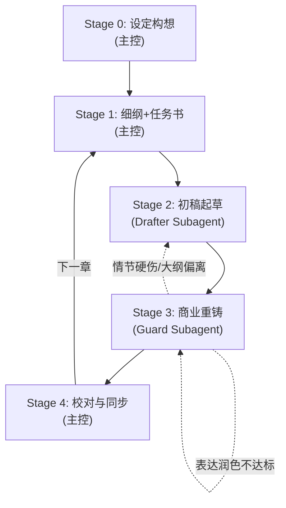

# novel_workflow.md — 小说创作流水线标准 SOP

本文档定义 Novel Studio 的 5 阶段（Stage 0–4）创作标准流程与各岗位交付规范。

---

## 一、 工作区目录规范

```
workspace/<slug>/
├── project.json        # 项目配置（书名、题材、主角、目标字数、全局禁忌等）
├── bible/              # 世界观设定、势力、力量体系、偏离清单
├── characters/         # 人物卡设定（自由文本，供构思与生成参考）
├── outlines/           # 大纲体系
│   ├── main_plot.md    # 全书主线脊柱
│   └── vol_XX/         # 分卷大纲与细纲
│       ├── outline.md  # 本卷战役与剧情发展
│       └── beats/      # 逐章细纲与任务书（ch_XXX.md）
├── manuscript/         # 稿件仓库
│   └── vol_XX/
│       ├── raw/        # Drafter 初稿（ch_XXX_v1.md, ch_XXX_v2.md...）
│       └── final/      # Guard 重铸定稿（ch_XXX.md）
├── state/              # 状态机真值数据
│   ├── current.json    # 当前主角处境、状态与在场人物
│   ├── entities.json   # 人物/势力登记簿
│   ├── lines.json      # 伏笔、误会、秘密三线台账
│   ├── timeline.json   # 时间线与事件历法
│   ├── synopsis.json   # 分章梗概
│   ├── ledger.json     # 资产/资源流水
│   └── inbox/          # 提案收件箱（待合并与归档）
└── log/review/         # （可选/历史兼容）主控审校注记（ch_XXX.md）
```

---

## 二、 五阶段流程标准 (Stage 0–4)



### Stage 0: 设定构想与初始化（主控）

1. **执行初始化**：
   ```bash
   python studio.py init -w workspace/<slug> -t "书名" -g "题材" -p "主角名"
   ```
2. **完善核心资产**：
   - 参照 `templates/` 和 `agents/genre_guide.md` 填充 `bible/project_bible.md`、`characters/`、`outlines/main_plot.md`、`outlines/vol_01/outline.md`。
   - 如需自定义特殊设定或打破通用写作习惯，在 `project_bible.md` 的「本书偏离清单」中简要注明。
3. **完成验收**：
   - 运行 `python studio.py check`，确保核心槽位填充完毕，无阻断错误。

---

### Stage 1: 细纲与任务书装配（主控）

1. **输入准备**：
   - 检查进度与待填缺口：`python studio.py status`
   - 查看伏笔到期与线索缺口：`python studio.py evidence gaps`
   - 对照上章节奏与约束：`python studio.py evidence prev ch_XXX`
2. **编写单章细纲与任务书** (`outlines/vol_XX/beats/ch_XXX.md`)：
   - 结构包括：YAML Front-matter + 拍点 (Beats) + 线动作 (Line Actions) + 任务书四节。

```markdown
---
chapter: ch_001
vol: vol_01
form: 单场景章              # 章型（单场景/双线剪辑/日常/插叙/长镜头等）
pov: 林逐夜·贴身第三人称      # 本章视角
words: 2200-3500          # 参考字数区间
style_notes: 短句急促 | 闲笔入题 | 悬置收尾  # 风格旋钮
---
## 拍点
- 场景 1：...
- 场景 2：...

## 线动作
- 推进：GUN-001 (断刀线索)
- 埋设：KNO-002 (密信真伪)

## 目标
- 达成事件 A，推动主角做出选择 B。

## 必须保留
- 关键事实不变量（如：主角在此阶段仍不知晓黑衣人身份）。

## 本章禁忌
- 避免直接说明背景设定；避免连续感叹号与内心独白过长。

## 验收
- 1. 动词+名词明确判据（例：林逐夜在当铺完成断刀质押）。
```

---

### Stage 2: 初稿起草（Drafter 子代理）

1. **主控派发**：
   - 运行 `python studio.py pack ch_XXX` 获取分层上下文。
   - 使用 Antigravity 原生工具 `invoke_subagent` 派发 `drafter`。
2. **Drafter 职责（放飞算力，情节跑通）**：
   - 贯彻任务书「目标」与「拍点」，推进矛盾碰撞与事件因果。
   - **彻底松绑免责**：不受任何“AI禁词表”或修辞束缚，无需耗费算力雕琢文字；只要冲突饱满、逻辑自洽即可交卷。
   - 将完整稿件写入 `manuscript/vol_XX/raw/ch_XXX_v1.md`（严禁传入 ArtifactMetadata）。
   - 若遇到严重设定缺失导致无法动笔，在 raw 头部标明 `缺语境：<具体缺失内容>` 并退出。
3. **零盲读快速交接**：
   - Drafter 交付后，主控**严禁调用 `view_file` 全文读取 `raw/`**（避免万级正文污染主会话上下文）；
   - 主控确认文件存在后，直接进入 Stage 3 调度 Guard。

---

### Stage 3: 商业网文重铸（Guard 子代理）

1. **主控派发**：
   - 使用 Antigravity 原生工具 `invoke_subagent` 派发 `guard`（金牌网文责编与定稿总笔）。
   - **指令显式锁定**：主控下发的 Prompt **必须显式包含前置指令**：“第一步必须调用 `view_file` 完整阅读 `agents/rules/novel_craft.md` 全文，深刻领会《四大维度靶向手术法》、去AI味技法与降频准则；第二步再阅读当章任务书与 `raw/` 初稿开展商业重铸”。
2. **Guard 职责（四大维度靶向重铸）**：
   - **高光保护与三大基线**：保留生动传神细节与金句；情节事实、人设声纹、状态机数据绝对零篡改。
   - **四大维度手术**：
     - ① **剪辑降噪与程度副词降频**：切除次要流水账；杜绝车轱辘水字数；彻底拔除作者上帝视角旁白；程度副词（极/骤然）降频。
     - ② **人物质感与去面瘫**：打破男主永远“神色沉静”、女主永远“咬唇发抖”的面瘫标签；反派不弱智；对白机锋化。
     - ③ **节奏与语言调性**：平滑突兀转折（补足先兆推力）；破除正剧冷峻腔，注入松弛烟火气；优化长短句方差。
     - ④ **顺手纠错**：通读时顺手修正错别字、标点误用、前后称谓与物理穿帮。
   - 将定稿写入 `manuscript/vol_XX/final/ch_XXX.md`（严禁传入 ArtifactMetadata）。
3. **Guard 交付规范（轻量结构化简报）**：
   - Guard 完成后向主控汇报 **200 字结构化简报**（包含：字数、一句话核心梗概、重要实体/技能获取变动），不倾倒大段正文。

---

### Stage 4: 极速状态同步与快照封存（主控）

1. **单步组装提案**：
   - 彻底废除 `log/review/` 人工摘抄引文仪式（大幅削减 80% Token 消耗）；
   - 主控根据 Guard 交付简报，直接写入 `state/inbox/ch_XXX.json`（更新当前处境、人物状态、伏笔线推进与章节梗概）。
2. **单次统一校验与同步**：
   - 运行 `python studio.py sync ch_XXX`。
   - 引擎自动完成：提案数据校验 → 状态机原子合入 → 数据一致性体检 → 自动创建快照 `ch_XXX_done`。
3. **进入下一章**：立即推进下一章。

---

## 三、 省 Token 与上下文隔离五大铁律

为确保长篇长效创作过程中系统始终高速、低成本、零卡顿、零污染运行，严格执行以下五大刚性准则：

1. 🚫 **引擎黑盒铁律（严禁读取 engine/ 源码）**：
   - 日常创作期间，**严禁主控或任何子代理调用 `view_file` 读取 `engine/*.py` 底层源码**；
   - 引擎是纯粹的确定性黑盒工具，一律通过运行 `python studio.py <命令>` 获取结构化标准数据，源码 Token 消耗恒定为 0。

2. 🚫 **主控“零盲读”铁律（严禁在主会话通读正文）**：
   - 主控代理**严禁在主会话中对 `raw/` 和 `final/` 执行全文 `view_file`**，杜绝数万字正文永久滞留主会话历史造成上下文膨胀与注意力衰减；
   - 主控仅需阅读 Guard 交付的 **200 字轻量结构化简报**，即可完成 Stage 4 状态提案与同步。
3. 🚫 **工作区精准投喂（严禁大面积盲读 workspace/ 历史章节）**：
   - 严禁任何智能体对 `workspace/` 进行全局遍历，或调用 `view_file` 通读历史章节（如试图把 ch_001~ch_050 全读一遍）；
   - 历史事实与人际连贯性完全依赖 `python studio.py pack ch_XXX` 提供的精准分层上下文（P0 现场 + P1 实体 + P2 梗概 + 上章末尾 1000 字衔接）。
4. 🔄 **子代理沙箱闭环与会话定期轮转机制**：
   - Drafter 与 Guard 在独立沙箱中各自闭环读取材料并写入稿件，跨阶段只传递轻量级元数据；
   - 由于 Novel Studio 以 `state/` 状态机与 `outlines/` 为绝对真值，推荐每 5 章或按卷开启新会话。新会话只需执行 `studio pack ch_XXX` 即可在 2 秒内无缝复活最新全书状态，彻底抛弃累积的历史 Token 包袱！

---

## 四、 卷末与导出

- 每卷写作完成后，运行 `python studio.py check` 进行全卷体检。
- 运行 `python studio.py export --txt --views` 导出全书正文与阅读视图。

