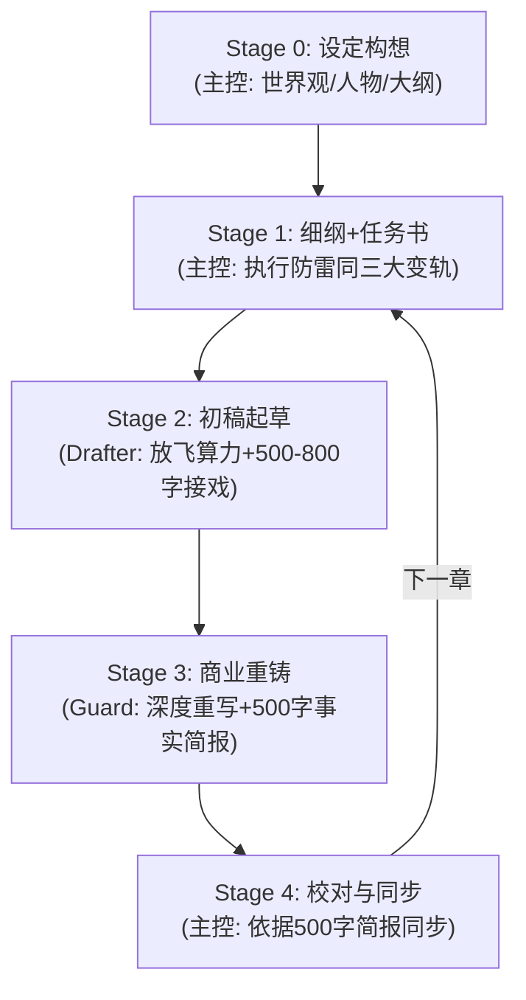

# novel_workflow.md — 通用小说创作流水线标准 SOP

本文档定义 Novel Studio 的 5 阶段（Stage 0–4）通用创作标准流程（适用于全题材）。

---

## 一、 五阶段流程标准 (Stage 0–4)

### Stage 0: 设定构想与初始化（主控）
- 初始化工作区，填充 `bible/`、`characters/` 与 `outlines/`。

### Stage 1: 细纲与任务书装配（主控 — 必须执行防结构雷同三大变轨）
- **变轨一（通用章形态轮转）**：明确指定 `form`，连续 3 章严禁使用相同形态（对抗破局 / 获取养成 / 人际推拉 / 探索转场 / 高潮兑现）；
- **变轨二（物理场景大位移）**：每 1-2 章推动角色转移空间场景；
- **变轨三（起手与结尾钩子变轨）**：轮转起手切入方式与章末悬念类型。

### Stage 2: 初稿起草（Drafter 子代理）
- **放飞算力与完整场面接戏**：Drafter 结合上一章末尾 500~800 字完整尾声场面与官方梗概，专注将故事讲生动、把冲突写饱满；
- 稿件写入 `manuscript/vol_XX/raw/ch_XXX_v1.md`。

### Stage 3: 商业网文重铸（Guard 子代理）
- **输入**：当章 beats + 章初 current + 初稿 raw；
- **金牌总笔深度重写**：前置阅读 `agents/rules/craft_guard.md`，拥有完全的自由重写、大刀阔斧剪辑与填坑权限；
- 纯净定稿写入 `manuscript/vol_XX/final/ch_XXX.md`，提交 **500 字结构化事实简报**（包含：剧情梗概、人物修为、道具流转、伏笔线索、人际演变）。

### Stage 4: 极速状态同步与快照封存（主控）
- 根据 Guard 简报写入 `state/inbox/ch_XXX.json`，运行 `python studio.py sync ch_XXX` 自动合并与归档。
